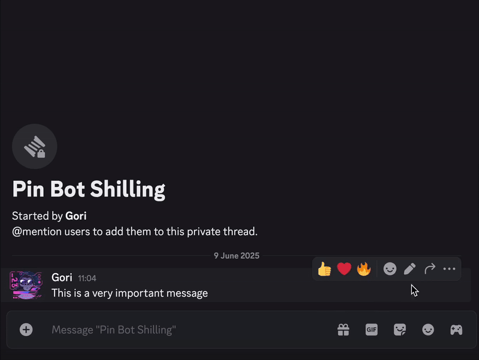

# Discord Pin Bot
Want to let members pin messages without giving them full message management permissions? Discord Pin Bot solves this by providing pin/unpin functionality through simple context menu commands, no broad permissions needed.

If you wanna use it, hosting it in [Railway](https://railway.com) takes less than minutes to setup.




## Setup

### Environment Configuration
This project uses [dotenvx](https://dotenvx.com/) for encrypted environment variable management. To set up your environment:

1. **Set up encryption** (this creates `.env.keys` automatically):
   ```bash
   npx dotenvx encrypt
   ```

2. **Add your Discord bot token**:
   ```bash
   npx dotenvx set DISCORD_TOKEN="your_bot_token_here"
   ```

### Running the Bot
```bash
npm run dev    # Development with hot reload
npm run build  # Build TypeScript
npm run start  # Production start
```

## Features

- 📌 **Context Menu Commands**: Pin and unpin messages via right-click menu
- 🔔 **Smart Notifications**: Automatic notifications when messages are pinned/unpinned
- 🛡️ **Error Handling**: Graceful error handling with helpful user feedback
- 🧵 **Thread Support**: Works in both text channels and threads
- ✅ **State Validation**: Prevents redundant pin/unpin operations
- 🔒 **Permission Aware**: Clear error messages for permission issues
